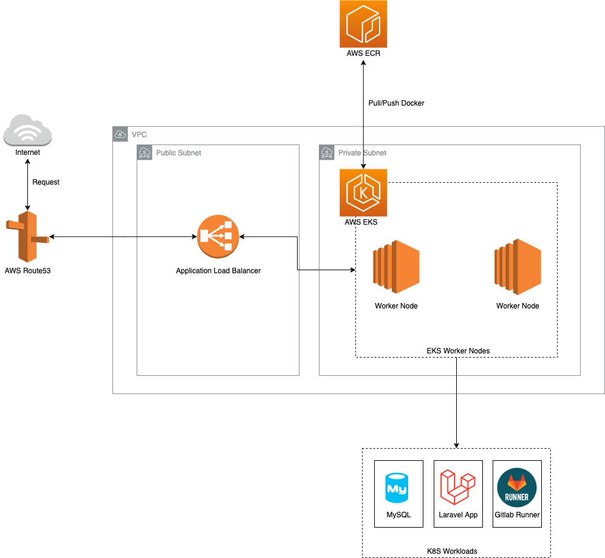
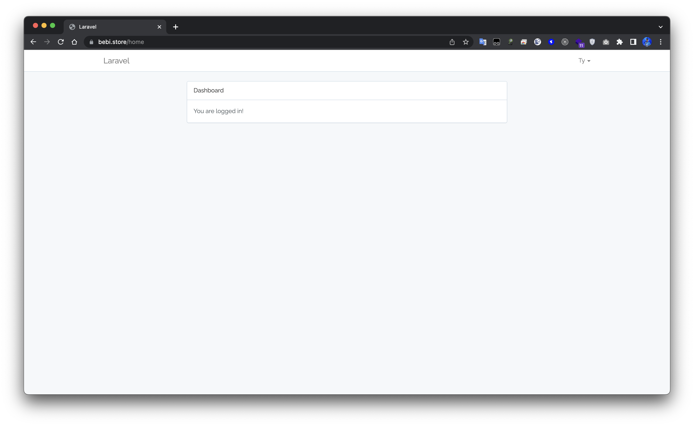
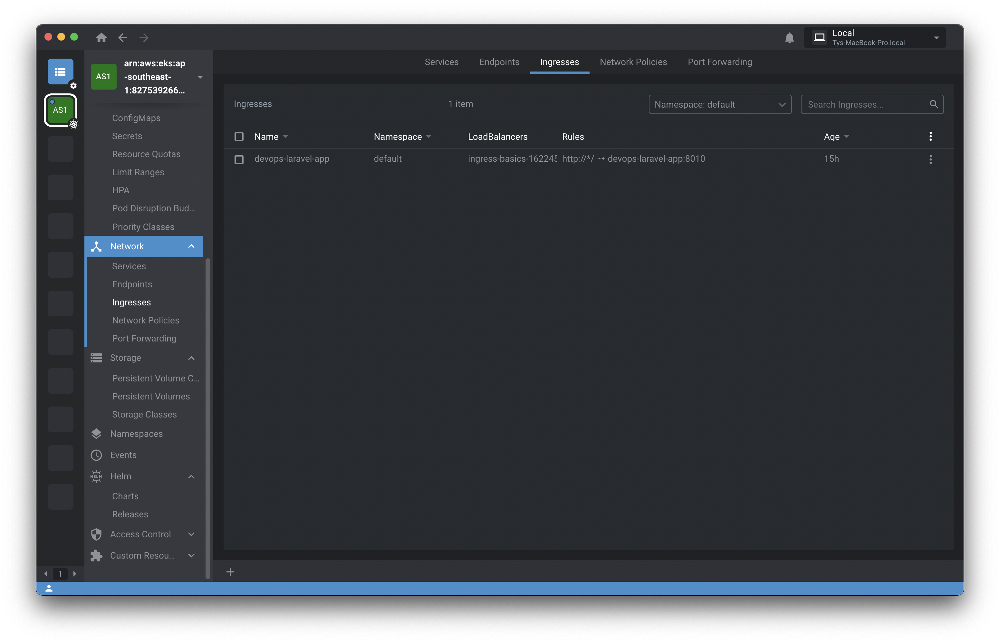

# DevOps Assessment

---

- [DevOps Assessment](#devops-assessment)
  - [Context](#context)
  - [Tech Stack](#tech-stack)
  - [Tasks](#tasks)
  - [Architecture Overview](#architecture-overview)
  - [AWS Well-Architected review](#aws-well-architected-review)
    - [Operational Excellence Pillar](#operational-excellence-pillar)
    - [Security Pillar](#security-pillar)
    - [Reliability Pillar](#reliability-pillar)
    - [Performance Efficiency Pillar](#performance-efficiency-pillar)
    - [Cost Optimization Pillar](#cost-optimization-pillar)
    - [Sustainability Pillar](#sustainability-pillar)
  - [Results](#results)
  - [References](#references)

---

## Context

1. Build a secure and small dockerized hello world Laravel app which can be successfully connected to a MySQL server.
2. Automate the process of building the app and pushing to a container registry using GitLab.
3. Bring up an autoscale EC2 cluster as a worker node group of an EKS cluster (For this IaC is enough, no need to apply on real infra)
4. Automate the deployment of built app on K8s cluster (locally you can use `minikube` or `kind` for K8s)
5. Add documentation of the whole procedure and how you made it well architected.

## Tech Stack

- **GitLab**: Code Repository for Laravel Application and CI/CD using self hosted runner in EKS (Autoscaling with Kubernetes)
- **Helm**: Package and deploy application in K8S.
- **Terraform**: Setup Network, provision AWS EKS Kubernetes Cluster, install EKS add-ons, managed some workloads in K8S.
- **AWS Services**:
  - Route 53
  - EKS
  - ACM
  - ALB
  - VPC
  - IAM

## Tasks

- [x] Setup EKS Cluster Terraform, structure module, install Helm, EKS add-ons.
- [x] Clone source code https://github.com/nahidulhasan/laravel-docker-k8s and running local test.
- [x] Install MySQL K8S, prepare script migrate DB for Laravel, automate pipeline migrate if necessary at the end stage.
- [x] Setup Helm repository in S3 using Terraform module, base helm chart application.
- [x] Using Helm app to deploy Dockerfile locally.
- [x] Using https://github.com/GoogleContainerTools/kaniko to Build Docker in Gitlab CI and publish to ECR.
- [x] Deploy and manage GitLab Runner in cluster EKS, make Gitlab Pipeline runnable.
- [x] Using Autoscaler to scale the cluster's worker nodes by number of pods and resources needed.
- [x] Document, draw architecture, explain how it work.

## Architecture Overview



## AWS Well-Architected review

### Operational Excellence Pillar

- Almost workloads using Infrastructure as code, automate all tasks managed AWS resources via **Terraform** tool instead of change manual.

- Containerize application using Docker, make consistent environment as much as possible, convenient to development and operation.

### Security Pillar

- Database layer deploy in **K8S** Private Subnet, data store in persistent **EBS** volumes, avoid missing data when MySQL workload shutdown.

- Using **RBAC** to avoid leak AWS IAM access key.

### Reliability Pillar

- Using **Helm** with **Gitlab CI**, make manage application workload become fully automated, easy to deploy application with adapting to changing or recreating resources, make consistent between multiple enviroment.

### Performance Efficiency Pillar

- Allocate and utilize resources efficiently based on needed with K8S.

### Cost Optimization Pillar

- Autoscale based on workloads with **Kubernetes Cluster Autoscaler**.

### Sustainability Pillar

- Using EKS managed, reduce task relative to master node K8S.

- Using Add-ons/Plugin EKS to automatic create resources necessary, for example create Route53, create ALB, EBS...

## Results

**Link**: https://bebi.store/

**Account**: typrone1@gmail.com | 123123

**Repository**:

- [tycloud / devops-laravel · GitLab](https://gitlab.com/tycloud/devops-laravel/)

- [GitHub - tycloud97/devops-exercise](https://github.com/tycloud97/devops-exercise)

**Screenshot**:








## References

- https://docs.aws.amazon.com/prescriptive-guidance/latest/patterns/set-up-a-helm-v3-chart-repository-in-amazon-s3.html
- https://github.com/nahidulhasan/laravel-docker-k8s
- https://github.com/stacksimplify/terraform-on-aws-eks
- https://www.weave.works/blog/running-dockerized-laravel-applications-on-top-of-kubernetes

_Useful CLI_

```bash
helm s3 init s3://ty-helm/stable/myapp
helm repo add stable-myapp s3://ty-helm/stable/myapp/
helm repo add gitlab https://charts.gitlab.io
aws eks --region ap-southeast-1 update-kubeconfig --name ty-dev-eksdemo
helm upgrade --namespace default gitlab-runner -f gitlab-runner-values.yaml gitlab/gitlab-runner
php artisan key:generate
php artisan migrate
helm s3 push --force ./app-0.0.1.tgz stable-myapp
docker build -t laraveldemo .  --platform=linux/amd64\ndocker tag laraveldemo:latest 827539266883.dkr.ecr.ap-southeast-1.amazonaws.com/laraveldemo:latest\ndocker push 827539266883.dkr.ecr.ap-southeast-1.amazonaws.com/laraveldemo:latest
helm upgrade devops-laravel devops/app --install --force --namespace devops-laravel -f deployment/dev.yaml --set image.repository=${DOCKER_IMAGE},image.tag=${DOCKER_TAG} -->
```
